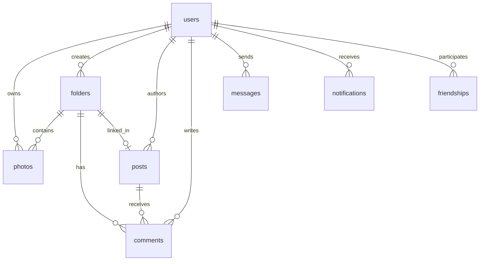

# GeoSnap Legacy Firestore Schema Documentation

This document describes the legacy Firestore database schema, field definitions, security access rules, and index configurations for the GeoSnap application prior to the GeoSnap Workspace transformation.

---

## 1. Overview & Security Architecture

GeoSnap uses Cloud Firestore as its primary NoSQL database. Security is enforced through Firestore Security Rules (`firestore.rules`) matching document paths and validating incoming payloads (`request.resource.data`) against existing state (`resource.data`).

### Security Rule Helper Functions

| Function | Definition | Purpose |
| :--- | :--- | :--- |
| `isAuthenticated()` | `request.auth != null` | Ensures the user is logged in. |
| `isOwner(userId)` | `isAuthenticated() && request.auth.uid == userId` | Validates that current user owns the specified user document. |
| `isDocOwner()` | `isAuthenticated() && request.auth.uid == resource.data.uid` | Validates that current user owns the target document via the `uid` field. |
| `uidUnchanged()` | `!('uid' in request.resource.data) \|\| request.resource.data.uid == request.auth.uid` | Enforces that newly written `uid` matches current auth UID. |
| `uidNotModified()` | `!('uid' in request.resource.data) \|\| request.resource.data.uid == resource.data.uid` | Prevents document ownership transfer on update. |
| `hasRequiredFields(fields)` | `request.resource.data.keys().hasAll(fields)` | Validates mandatory field presence. |
| `validOptionalStringLength(field, maxLen)` | `!(field in data) \|\| (data[field] is string && data[field].size() <= maxLen)` | Validates optional string fields and character count limits. |
| `isAdmin()` | `isAuthenticated() && ((exists(users/$(auth.uid)) && users.role == 'admin') \|\| (auth.token.email == "nguoicoich1234@gmail.com" && email_verified))` | Authorizes administrative actions via Firestore role or verified admin email fallback. |
| `areFriends(uid1, uid2)` | `exists(friendships/$(uid1_uid2)) \|\| exists(friendships/$(uid2_uid1))` | Checks bidirectional friendship document existence. |
| `isFriendshipAccepted(uid1, uid2)` | `get(friendships/$(uid1_uid2)).data.status == 'accepted' \|\| get(friendships/$(uid2_uid1)).data.status == 'accepted'` | Checks bidirectional friendship status equality to `'accepted'`. |

---

## 2. Collections & Field Specifications

### 2.1 `users/{userId}`

Stores user account profiles, authentication metadata, roles, and bio information.

#### Schema & Fields

| Field Name | Type | Optional | Constraints | Description |
| :--- | :--- | :--- | :--- | :--- |
| `uid` | `string` | No | Required, matches Document ID | Firebase Auth User ID |
| `email` | `string` | No | Required, max length 200 chars | Primary user email address |
| `displayName` | `string` | Yes | Max length 100 chars | User public display name |
| `avatarUrl` | `string` | Yes | Max length 2048 chars | URL to profile picture |
| `role` | `string` | No | `'admin'` \| `'user'` | Role-based authorization tier |
| `inviteCode` | `string` | Yes | Max length 20 chars | Unique referral / invite code |
| `bio` | `string` | Yes | Max length 300 chars | Short user bio/status text |
| `createdAt` | `string` | No | ISO 8601 string | User creation timestamp |

#### Access Control Rules
- **Read**: Any authenticated user (`isAuthenticated()`).
- **Create**: Document owner (`isOwner(userId)`), must satisfy `isValidUser()`, `uidUnchanged()`, and `role == 'user'` (or caller is admin).
- **Update**: Document owner with immutable `role` and `createdAt`, or any administrator (`isAdmin()`).
- **Delete**: Disallowed via client rules.

---

### 2.2 `photos/{photoId}`

Stores individual photo metadata, GPS coordinates, capture dates, and folder associations.

#### Schema & Fields

| Field Name | Type | Optional | Constraints | Description |
| :--- | :--- | :--- | :--- | :--- |
| `uid` | `string` | No | Required | Owner User ID |
| `url` | `string` | No | Required, max length 10MB (10485760 chars) | Cloud Storage download URL |
| `latitude` | `number` | Yes | Valid IEEE 754 float | GPS Latitude extracted from EXIF |
| `longitude` | `number` | Yes | Valid IEEE 754 float | GPS Longitude extracted from EXIF |
| `takenAt` | `string` | Yes | ISO 8601 string | Timestamp when photo was captured |
| `uploadedAt` | `string` | No | ISO 8601 string | Timestamp when photo was uploaded |
| `hasGps` | `boolean` | No | Boolean (`true` / `false`) | Flag indicating GPS tag presence |
| `folderId` | `string` | Yes | Reference to `folders/{folderId}` | Clustered location folder ID |

#### Access Control Rules
- **Read**: Document owner (`isDocOwner()`) or administrator (`isAdmin()`).
- **Create**: Authenticated user (`isAuthenticated()`), must pass `isValidPhoto()`, `uidUnchanged()`.
- **Update**: Document owner (`isDocOwner()`), `uploadedAt` and `uid` are immutable.
- **Delete**: Document owner (`isDocOwner()`) or administrator (`isAdmin()`).

---

### 2.3 `folders/{folderId}`

Represents auto-clustered geographical locations (via DBSCAN 200m) or manual albums grouping photos taken at the same destination.

#### Schema & Fields

| Field Name | Type | Optional | Constraints | Description |
| :--- | :--- | :--- | :--- | :--- |
| `uid` | `string` | No | Required | Owner User ID |
| `name` | `string` | No | Required, max length 500 chars | Name of location/album |
| `country` | `string` | Yes | Max length 100 chars | Reverse-geocoded country |
| `city` | `string` | Yes | Max length 100 chars | Reverse-geocoded city / province |
| `district` | `string` | Yes | Max length 100 chars | Reverse-geocoded district |
| `street` | `string` | Yes | Max length 100 chars | Reverse-geocoded street address |
| `centerLat` | `number` | No | Required float | Cluster center latitude |
| `centerLng` | `number` | No | Required float | Cluster center longitude |
| `coverPhotoUrl` | `string` | Yes | Max length 10485760 chars | Featured cover image URL |
| `photoCount` | `number` | No | Required, integer $\ge 0$ | Total number of photos contained |
| `firstVisitedAt` | `string` | Yes | ISO 8601 string | Earliest photo capture date |
| `lastVisitedAt` | `string` | Yes | ISO 8601 string | Most recent photo capture date |
| `createdAt` | `string` | No | ISO 8601 string | Folder creation timestamp |
| `visibility` | `string` | Yes | `'private'` \| `'friends'` \| `'public'` | Privacy level (defaults to private) |
| `description` | `string` | Yes | Max length 500 chars | Custom notes or trip summary |
| `reactions` | `map` | Yes | Map (`Record<string, string>`) | Emoji reactions mapped by `userId -> emoji` |

#### Access Control Rules
- **Read**: Allowed if document owner (`isDocOwner()`), admin (`isAdmin()`), public visibility (`visibility == 'public'`), or friends visibility with verified accepted status (`visibility == 'friends' && isFriendshipAccepted(auth.uid, doc.uid)`).
- **Create**: Authenticated user (`isAuthenticated()`), must pass `isValidFolder()`, `uidUnchanged()`.
- **Update**: Document owner (`isDocOwner()`), `createdAt` is immutable.
- **Delete**: Document owner (`isDocOwner()`) or administrator (`isAdmin()`).

---

### 2.4 `friendships/{friendshipId}`

Manages social connections, friend requests, and relationship states between users. Document ID standard: `${requesterId}_${addresseeId}` or auto-generated ID.

#### Schema & Fields

| Field Name | Type | Optional | Constraints | Description |
| :--- | :--- | :--- | :--- | :--- |
| `requesterId` | `string` | No | Required | User ID initiating request |
| `addresseeId` | `string` | No | Required | User ID receiving request |
| `status` | `string` | No | `'pending'` \| `'accepted'` \| `'blocked'` | Friendship state |
| `createdAt` | `string` | No | ISO 8601 string | Timestamp when request was sent |
| `updatedAt` | `string` | Yes | ISO 8601 string | Timestamp of status modification |

#### Access Control Rules
- **Read**: Authenticated user participating as either `requesterId` or `addresseeId`.
- **Create**: Authenticated user where `requesterId == request.auth.uid` and initial status is strictly `'pending'`.
- **Update**: Authenticated user who is either `addresseeId` (to accept/block) or `requesterId`.
- **Delete**: Authenticated user who is either `requesterId` or `addresseeId` (unfriend/cancel).

---

### 2.5 `notifications/{notificationId}`

System and social notifications dispatched to users for real-time engagement.

#### Schema & Fields

| Field Name | Type | Optional | Constraints | Description |
| :--- | :--- | :--- | :--- | :--- |
| `recipientId` | `string` | No | Required | User ID receiving notification |
| `actorId` | `string` | No | Required | User ID triggering event |
| `actorProfile` | `map` | Yes | Conforms to `UserProfile` | Embedded snapshot of actor |
| `type` | `string` | No | `'friend_request'` \| `'friend_accepted'` \| `'reaction'` \| `'comment'` \| `'new_location'` \| `'new_post'` | Event classification |
| `entityId` | `string` | Yes | `folderId`, `postId`, or `friendshipId` | Target entity identifier |
| `entityName` | `string` | Yes | String | Human-readable name of entity |
| `isRead` | `boolean` | No | Required boolean | Read / unread status |
| `createdAt` | `string` | No | ISO 8601 string | Notification creation timestamp |

#### Access Control Rules
- **Read**: Restricted to recipient (`recipientId == request.auth.uid`).
- **Create**: Authenticated user (`isAuthenticated()`) with valid notification format.
- **Update**: Restricted to recipient (`recipientId == request.auth.uid`) to toggle `isRead`.
- **Delete**: Restricted to recipient (`recipientId == request.auth.uid`).

---

### 2.6 `comments/{commentId}`

User comments posted on location folders or social feed posts.

#### Schema & Fields

| Field Name | Type | Optional | Constraints | Description |
| :--- | :--- | :--- | :--- | :--- |
| `uid` | `string` | No | Required | Comment author User ID |
| `folderId` | `string` | Yes* | Must have either `folderId` or `postId` | Target folder ID |
| `postId` | `string` | Yes* | Must have either `folderId` or `postId` | Target post ID |
| `content` | `string` | No | Required, max length 500 chars | Text comment content |
| `userProfile` | `map` | Yes | Conforms to `UserProfile` | Embedded author profile snapshot |
| `createdAt` | `string` | No | ISO 8601 string | Creation timestamp |

*\*Note: Validation requires at least one target (`folderId` or `postId`) to be present.*

#### Access Control Rules
- **Read**: Any authenticated user (`isAuthenticated()`).
- **Create**: Authenticated user where `uid == request.auth.uid`, content length $\le 500$, and contains `folderId` or `postId`.
- **Update**: **Disallowed** (`allow update: if false;` — comments are immutable).
- **Delete**: Author only (`resource.data.uid == request.auth.uid`).

---

### 2.7 `posts/{postId}`

Social posts and 24-hour stories published to the community feed.

#### Schema & Fields

| Field Name | Type | Optional | Constraints | Description |
| :--- | :--- | :--- | :--- | :--- |
| `uid` | `string` | No | Required | Author User ID |
| `type` | `string` | No | `'post'` \| `'story'` | Post type |
| `content` | `string` | No | Required string | Post caption or body |
| `imageUrls` | `list` | No | List of strings | Array of photo URLs |
| `folderId` | `string` | Yes | Reference to `folders` | Optional attached location folder |
| `location` | `map` | Yes | `{ lat: number, lng: number, name: string }` | Tagged geographical location |
| `reactions` | `map` | No | Default `{}` | Map of `userId -> emoji` |
| `commentCount` | `number` | No | Default `0` | Cached count of comments |
| `shareCount` | `number` | No | Default `0` | Cached count of shares |
| `visibility` | `string` | No | `'friends'` \| `'public'` \| `'private'` | Access visibility level |
| `expiresAt` | `string` | Yes | ISO 8601 string | Expiration timestamp (stories only, 24h) |
| `createdAt` | `string` | No | ISO 8601 string | Publication timestamp |
| `userProfile` | `map` | Yes | Conforms to `UserProfile` | Client-enriched author profile |

#### Access Control Rules
- **Read**: Owner (`isDocOwner()`), admin (`isAdmin()`), public visibility (`visibility == 'public'`), or friends visibility with accepted status (`isFriendshipAccepted(auth.uid, doc.uid)`).
- **Create**: Authenticated user (`uid == request.auth.uid`), valid type, list of images, and valid visibility.
- **Update**: Document owner (`isDocOwner()`) OR authenticated peer users modifying only atomic counter/interaction fields: `['reactions', 'commentCount', 'shareCount']`.
- **Delete**: Document owner (`isDocOwner()`) or administrator (`isAdmin()`).

---

### 2.8 `messages/{messageId}`

Direct chat messages exchanged between users in private 1-on-1 conversations.

#### Schema & Fields

| Field Name | Type | Optional | Constraints | Description |
| :--- | :--- | :--- | :--- | :--- |
| `conversationId` | `string` | No | Required | Conversation group key (e.g., `uid1_uid2`) |
| `senderId` | `string` | No | Required | Author User ID |
| `senderName` | `string` | No | Required | Display name of sender |
| `senderAvatar` | `string` | Yes | URL string | Avatar URL of sender |
| `recipientId` | `string` | No | Required | Recipient User ID |
| `content` | `string` | No | Required, max length 1000 chars | Message text content |
| `createdAt` | `string` | No | ISO 8601 string | Sent timestamp |

#### Access Control Rules
- **Read**: Participants only (`senderId == request.auth.uid || recipientId == request.auth.uid`).
- **Create**: Authenticated sender (`senderId == request.auth.uid`), valid string content $\le 1000$ chars.
- **Update**: Disallowed.
- **Delete**: Message sender (`senderId == request.auth.uid`).

---

## 3. Firestore Indexes (`firestore.indexes.json`)

The legacy schema utilizes composite indexes on the `messages` collection for paginated conversation queries:

```json
{
  "indexes": [
    {
      "collectionGroup": "messages",
      "queryScope": "COLLECTION",
      "fields": [
        { "fieldPath": "conversationId", "order": "ASCENDING" },
        { "fieldPath": "createdAt", "order": "ASCENDING" }
      ]
    },
    {
      "collectionGroup": "messages",
      "queryScope": "COLLECTION",
      "fields": [
        { "fieldPath": "conversationId", "order": "ASCENDING" },
        { "fieldPath": "createdAt", "order": "DESCENDING" }
      ]
    }
  ],
  "fieldOverrides": []
}
```

---

## 4. Entity Relationship Diagram (Legacy)


