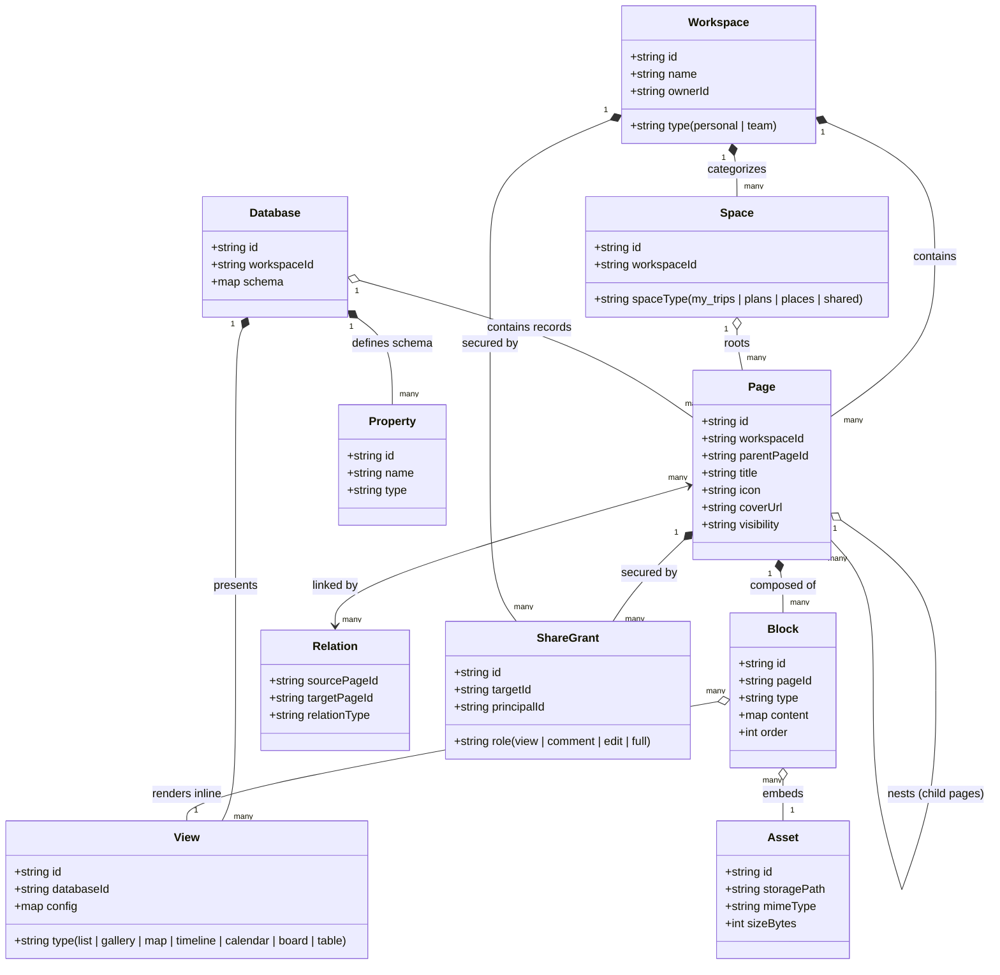

# GeoSnap Workspace Domain Glossary & Entity Model

This document defines the core domain concepts, entity models, Firestore collection mappings, and relational architectures for the **GeoSnap Workspace** model.

---

## 1. Domain Model Overview

GeoSnap Workspace transitions GeoSnap from a photo-location album app into a flexible, modular workspace platform designed for travel journaling, trip planning, location curation, and group collaboration.



---

## 2. Core Domain Glossary

### 1. Workspace
- **Definition**: The top-level container for all user or team content, permissions, spaces, pages, and databases. Every user receives a default Personal Workspace upon registration. Users can collaborate by creating or joining Shared/Team Workspaces.
- **Firestore Collection Mapping**: `workspaces/{workspaceId}`
  - Example document fields: `id`, `name`, `ownerId`, `type` (`'personal'` | `'team'`), `members` (`map userId -> role`), `createdAt`, `updatedAt`.
- **Relationship to Other Terms**:
  - Contains multiple **Spaces**, **Pages**, and **Databases**.
  - Serves as the root boundary for **ShareGrants** and member access.

---

### 2. Space
- **Definition**: A designated primary category or partition within a workspace that organizes pages by life-cycle or theme (e.g., *My Trips*, *Travel Plans*, *Places & Spots*, *Shared with Me*). Implemented as root pages with specialized space metadata.
- **Firestore Collection Mapping**: Represented as root documents in `pages/{pageId}` with `isSpace: true` or `workspaces/{workspaceId}/spaces/{spaceId}`.
  - Fields: `id`, `workspaceId`, `name`, `icon`, `spaceType` (`'my_trips'` | `'plans'` | `'places'` | `'shared'`), `order`, `createdAt`.
- **Relationship to Other Terms**:
  - Belongs to one **Workspace**.
  - Serves as the top-level parent for hierarchical **Pages**.

---

### 3. Page
- **Definition**: The fundamental unit of content in the workspace. A page can represent a trip journal, place profile, packing checklist, travel guide, or customized dashboard. Pages can nest hierarchically and contain an ordered sequence of content blocks.
- **Firestore Collection Mapping**: `pages/{pageId}` (or subcollection `workspaces/{workspaceId}/pages/{pageId}`)
  - Fields: `id`, `workspaceId`, `parentPageId` (nullable), `title`, `icon`, `coverUrl`, `databaseId` (if page is a database entry), `propertyValues` (map), `visibility` (`'private'` | `'shared'` | `'public'`), `createdAt`, `updatedAt`, `createdBy`.
- **Relationship to Other Terms**:
  - Parent container for **Blocks**.
  - Can be a row/entry within a **Database**.
  - Can have parent and child **Pages**.
  - References external **Assets** and **ShareGrants**.

---

### 4. Block
- **Definition**: An atomic, modular content element inside a page. Blocks can be dragged, reordered, transformed, and styled independently. Examples include text paragraphs, headings, image attachments, photo galleries, interactive maps, checklists, quote callouts, dividers, child page links, and embedded database views.
- **Firestore Collection Mapping**: `pages/{pageId}/blocks/{blockId}` or embedded array `blocks` in `pages/{pageId}` for fast atomic document reads.
  - Fields: `id`, `pageId`, `type` (`'paragraph'` | `'heading'` | `'image'` | `'gallery'` | `'map'` | `'checklist_item'` | `'quote'` | `'divider'` | `'child_page'` | `'database_view'`), `content` (flexible JSON payload), `order` (number / fractional index), `assetIds` (array of string), `createdAt`, `updatedAt`.
- **Relationship to Other Terms**:
  - Belongs to exactly one **Page**.
  - Can embed binary **Assets** (photos, videos).
  - Can embed dynamic **Database Views**.

---

### 5. Database
- **Definition**: A structured collection of pages sharing a unified property schema. Databases enable users to organize entities such as Trips, Places, Tasks, Accommodations, and Expenses with typed attributes and multiple viewing modes.
- **Firestore Collection Mapping**: `databases/{databaseId}`
  - Fields: `id`, `workspaceId`, `name`, `description`, `icon`, `schema` (map of property definitions), `createdAt`, `updatedAt`.
- **Relationship to Other Terms**:
  - Contains multiple records, where each record is a specialized **Page**.
  - Defined by a collection of **Properties**.
  - Rendered through one or more **Views**.

---

### 6. View
- **Definition**: A visual presentation mode and filter/sort configuration for a Database. The underlying database pages remain identical, while the view renders them in different user-facing formats: List, Gallery, Map, Timeline, Calendar, Board (Kanban), or Table.
- **Firestore Collection Mapping**: `databases/{databaseId}/views/{viewId}`
  - Fields: `id`, `databaseId`, `name`, `type` (`'list'` | `'gallery'` | `'map'` | `'timeline'` | `'calendar'` | `'board'` | `'table'`), `filters` (array of filter rules), `sorts` (array of sort rules), `groupingPropertyId` (for boards), `visibleProperties` (array of property IDs).
- **Relationship to Other Terms**:
  - Belongs to a **Database**.
  - Can be embedded into any **Page** via a Database View **Block**.

---

### 7. Property
- **Definition**: A typed metadata field defined within a database schema and populated on individual database pages. Supported property types include Status, Date/DateRange, Geolocation, Tags/Multi-select, People/Collaborators, Rating, Budget/Currency, Cover Image, and Visibility.
- **Firestore Collection Mapping**: Stored as items inside `schema` map of `databases/{databaseId}`:
  ```json
  {
    "properties": {
      "prop_status": { "name": "Status", "type": "status", "options": ["Planning", "Active", "Completed"] },
      "prop_dates": { "name": "Trip Dates", "type": "date_range" },
      "prop_location": { "name": "Destination", "type": "location" },
      "prop_budget": { "name": "Budget", "type": "currency", "currencyCode": "VND" }
    }
  }
  ```
- **Relationship to Other Terms**:
  - Schema configured on the **Database**.
  - Values stored in the `propertyValues` map of corresponding **Pages**.

---

### 8. Relation
- **Definition**: A bidirectional link connecting two database records/pages. Relations allow users to associate entities across databases (e.g., linking a *Trip* page to multiple visited *Place* pages, or linking a *Place* page to associated *Photo* assets or journal notes).
- **Firestore Collection Mapping**: `relations/{relationId}` or bidirectional reference arrays inside `propertyValues` (`relationPageIds: string[]`).
  - Fields: `id`, `sourcePageId`, `targetPageId`, `sourceDatabaseId`, `targetDatabaseId`, `relationType` (`'one_to_one'` | `'one_to_many'` | `'many_to_many'`), `createdAt`.
- **Relationship to Other Terms**:
  - Connects two **Pages**.
  - Enables cross-database lookups between distinct **Databases**.

---

### 9. Asset
- **Definition**: A binary file (geotagged photo, video, travel voucher PDF, or audio note) stored in Firebase Cloud Storage, with rich metadata (EXIF GPS, camera specs, dimensions, thumbnail URLs) tracked in Firestore.
- **Firestore Collection Mapping**: `assets/{assetId}`
  - Fields: `id`, `workspaceId`, `storagePath`, `downloadUrl`, `thumbnailUrl`, `mimeType`, `sizeBytes`, `width`, `height`, `latitude`, `longitude`, `takenAt`, `uploadedBy`, `createdAt`.
- **Relationship to Other Terms**:
  - Stored in Cloud Storage; referenced in Firestore by **Blocks**, **Pages** (as cover images), and **Properties**.

---

### 10. ShareGrant
- **Definition**: An explicit permission record controlling access rights for a specific user, team, or public token to a workspace, space, or page. Defines granular permission tiers: `view`, `comment`, `edit`, and `full` (admin).
- **Firestore Collection Mapping**: `share_grants/{grantId}` (or subcollection `pages/{pageId}/share_grants/{grantId}`)
  - Fields: `id`, `targetType` (`'workspace'` | `'page'`), `targetId`, `principalType` (`'user'` | `'team'` | `'public'`), `principalId` (userId or public token), `role` (`'view'` | `'comment'` | `'edit'` | `'full'`), `grantedBy`, `expiresAt` (optional ISO 8601), `createdAt`.
- **Relationship to Other Terms**:
  - Secures **Workspaces**, **Spaces**, and **Pages**.
  - Evaluated in Firestore Security Rules to authorize read/write operations.

---

## 3. Summary Mapping Table

| Domain Entity | Firestore Collection | Primary Identifiers | Key Relationships |
| :--- | :--- | :--- | :--- |
| **Workspace** | `workspaces/{workspaceId}` | `workspaceId` | Parent of Spaces, Pages, Databases, ShareGrants |
| **Space** | `pages/{pageId}` (root) | `pageId`, `workspaceId` | Categorizes Pages under Workspace |
| **Page** | `pages/{pageId}` | `pageId`, `parentPageId` | Contains Blocks; entry in Database; targets ShareGrants |
| **Block** | `pages/{pageId}/blocks/{blockId}` | `blockId`, `pageId` | Unit of Page; references Assets & Views |
| **Database** | `databases/{databaseId}` | `databaseId`, `workspaceId` | Schematizes Pages; rendered via Views |
| **View** | `databases/{databaseId}/views/{id}` | `viewId`, `databaseId` | Visual presentation of Database records |
| **Property** | Embedded in `databases.schema` | `propertyId` | Attribute schema on Database, values on Page |
| **Relation** | `relations/{relationId}` | `relationId`, `sourcePageId`, `targetPageId` | Connects Pages across Databases |
| **Asset** | `assets/{assetId}` | `assetId`, `storagePath` | Binary asset referenced by Blocks and Pages |
| **ShareGrant** | `share_grants/{grantId}` | `grantId`, `targetId`, `principalId` | Access control rule for Workspace/Page |
